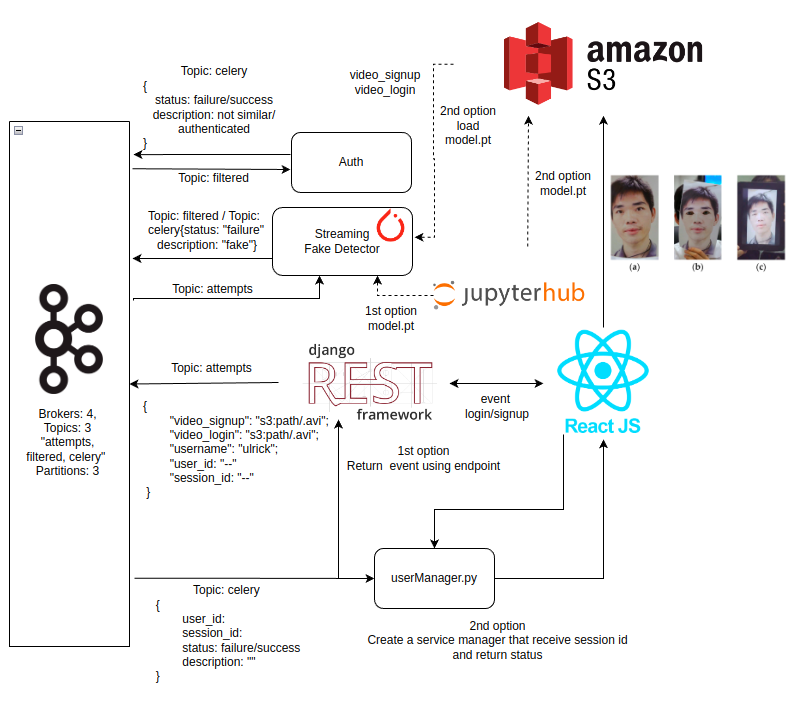

## General

This repository implement a pipeline to process an antispoofing system for stages such as `antispoofing, extractor and verification`in order to authenticate a user through short videos. Secondly, the system has incorporated a training arquitecture from develop and deploy deep learning models for anti-spoffing attacks that will be used from the first process `antispoofing`.

## Dependencies

- Apache Kafka

* Python dependencies on development `requirements/dev.in`:

```shell
bandit
black
editdistance
itermplot
jupyterlab
matplotlib
mypy
nltk
pycodestyle
pydocstyle
pylint
pytest
pyyaml
tornado
safety
scipy
pillow
pandas
autopep8
requests

```

- Python dependencies on production `requirements/prod.in`:

```shell
deepface
paramiko
opencv-python
confluent-kafka
python-dotenv
imutils
boltons
editdistance
flask
h5py
numpy
torch==1.8.1+cu101
torchvision==0.9.1+cu101
torchaudio==0.8.1
pytorch-lightning
torch-metrics
requests
smart_open
toml
rarfile
patool
wget
```

## Structure

##### Antispoofing Service

## Apple Silicon Setup

### Conda

1. Install conda’s Miniforge distribution
2. Create env for Conda named antispoofing
   `conda create -n antispoofing python=3.8`
3. Activate env
   `conda activate antispoofing`

### Dependencies

#### Tensorflow (for Deepface)

1. Dependencies
   `conda install -c apple tensorflow-deps`
2. Tensorflow itself
   `pip install tensorflow-macos tensorflow-metal`

#### Kafka

[Reference](https://github.com/confluentinc/confluent-kafka-python/issues/1190)

1. Dependencies
   `brew install librdkafka`
2. Kafka itself
   `C_INCLUDE_PATH=/opt/homebrew/Cellar/librdkafka/1.8.2/include LIBRARY_PATH=/opt/homebrew/Cellar/librdkafka/1.8.2/lib pip install confluent-kafka`

#### scikit-learn

1. Dependencies
   `brew install openblas`
2. Env variables

```
export OPENBLAS=$(/opt/homebrew/bin/brew --prefix openblas)
export CFLAGS="-falign-functions=8 ${CFLAGS}"
```

3. sklearn itself
   `pip install scikit-learn==0.24.1`

#### Complete deepface dependencies

```
pip install retina-face —no-deps
pip install pandas Flask gdown mtcnn fire
```

#### Other dependencies

`pip install imutils opencv-python paramiko python-dotenv `

## Structure

#### BaseDataCapture

This class provides a general structure inherited by the classes detailed below. It implements methods related
with the communication through Kafka.

##### Antispoofing Service

This service is in charge of prevent spoofing attacks for this reason, It receives events that contains `video_base_url` and also in some situations a `video_prueba_url`, either one video or both of them will be taken as input of a model pretrained to evaluate if is real or fake video, then depending of the results it generate an event with success or error as described in the diagram.

<p align="center">
  
</p>

- Input: **antispoofing** < timestamp> _(length 13)_ + <user*id> *(length 36)_ + <process_id> _(length 36)_ + <video_base_url> _(length 64)_ + <video_prueba_url> _(length 64)_ + < firma > _(length 64)\_

* Output: **celery** < timestamp> _(length 13)_ + _(json)_ + < firma > _(length 64)_

  ```shell
  data: {
      "task": "antispoofing",
      "data": {
          "process_id": <UUID>,
          "status": "error"
      }
  }
  ```

* Output: **extractor** < timestamp> _(length 13)_ + <user*id> *(length 36)_ + <process_id> _(length 36)_ + <video_base_url> _(length 64)_ + <video_prueba_url> _(length 64)_ + < firma > _(length 64)\_

##### Extractor Service

This service is in charge of extract three images(left image, frontal images and right image) for each video received. This service receives events that contains `video_base_url` and also in some situations a `video_prueba_url`, either one video or both of them will be taken as input of the face extractor algorithm, then depending of the results it generate an event with success or error as described in the diagram.

<p align="center">
  
</p>

- Input: **extractor**
  < timestamp> _(length 13)_ + <user*id> *(length 36)_ + <process_id> _(length 36)_ + <video_base_url> _(length 64)_ + <video_prueba_url> _(length 64)_ + < firma > _(length 64)\_

  - When video_prueba_url is not blank, extracts faces from both videos. If there is an error, sends it to celery with 'task': 'extractor' and 'status: error'. 
  - When video_prueba_url is blank, it only extracts the base video. If there is an error, sends it to celery with 'task': 'extractor' and 'status: error'. If the process can extract 3 images, do not upload and send success to celery with 'task': 'extractor' and 'status: success'.

- Output: **celery** < timestamp> _(length 13)_ + _(json)_ + < firma > _(length 64)_

  ```shell
  data: {
      "task": "extractor",
      "data": {
          "process_id": <UUID>,
          "image_base_central_url": "path",
          "status": "error" or "success"
      }
  }

  ```

- Output: **verification**
  < timestamp> _(length 13)_ + <user*id> *(length 36)_ + <process_id> _(length 36)_ + <img_left_base> _(length 64)_ + <img_right_base> _(length 64)_ + <img_frontal_base> _(length 64)_ + <img_left_test> _(length 64)_ + <img_right_test> _(length 64)_ + <img_frontal_test> _(length 64)_ + < firma > _(length 64)\_

##### verification Service

This service is in charge of verify if the base image any of the three categories(left image, frontal images and right image) correspond to the test images. This service receives events that contains `img_*_base` and `img_*_test`, either only base images or both base and test images will be taken as input of the a similarity algorithm that is deepface in order to compute how similar are the base images with test images, then depending of the results it generate an event with success authentication or error.

<p align="center">
  
</p>

- Input: \*verification\*\*
  < timestamp> _(length 13)_ + <user*id> *(length 36)_ + <process_id> _(length 36)_ + <img_left_base> _(length 64)_ + <img_right_base> _(length 64)_ + <img_frontal_base> _(length 64)_ + <img_left_test> _(length 64)_ + <img_right_test> _(length 64)_ + <img_frontal_test> _(length 64)_ + < firma > _(length 64)\_
- Output: **cryptomarket-celery**
  < timestamp> _(length 13)_ + _(json)_ + < firma > _(length 64)_

  ```shell
  data: {
      "task": "verification",
      "data": {
          "process_id": <UUID>,
          "status": "success",
          "similarity_factor_left": <double>,
          "similarity_factor_right": <double>,
          "similarity_factor_frontal": <double>,
      }
  }

  ```

  ```shell
  data: {
      "task": "verification",
      "data": {
          "process_id": <UUID>,
          "status": "error"
      }
  }

  ```

## Usage

- Create the environment

  In the main level we find the following files:

  - **environment.yml**: In this file we set the main dependencies in the project

    ```yml
    name: antispoofing
    channels:
      - defaults
    dependencies:
      - python=3.9
      - cudatoolkit=10.1
      - cudnn=7.6
      - pip
      - pip:
          - pip-tools
    ```

  - **Makefile**: This file allow us to create some shorcuts to update either the main or secondary environment dependencies.

    ```makefile
    # Install exact Python and CUDA versions
    conda-update:
    	conda env update --prune -f environment.yml
    	echo "!!!RUN RIGHT NOW:\nconda activate antispoofing"

    # Compile and install exact pip packages
    pip-tools:
    	pip install pip-tools
    	pip-compile --find-links=https://download.pytorch.org/whl/torch_stable.html requirements/prod.in && pip-compile requirements/dev.in
    	pip-sync requirements/prod.txt requirements/dev.txt

    # Example training command
    train:
    	python training/run_experiment.py --max_epochs=10 --gpus=-1 --accelerator=ddp --num_workers=20 --data_class=MNIST --model_class=MLP

    ```

```shell
make conda-udpate
```

Then, to udpate the secondary dependencies in the environment. Remind first to get into the environment with `conda activate antispoofing`

```shell
make pip-tools
```

- Run the engine to process videos and images trought kafka topics as described in the diagram.

  1. **export** the root project path with `export PYTHONPATH=.` in order python take it as reference.
  2. **Open tunnels** running in a new terminal `bash tunnels.sh`.
  3. Then start filtering fake videos using the class `Liveproof` that use the model pretrained to detect spoffing attacks. For that run the folloing commandline:

     ```shell
     python app.py --topic=antispoofing

     ```

  4. Then, to get pictures(left,right and frontal) for the correct videos use the class `extractor` and run the following commandline:

     ```shell
     python app.py --topic=Imagesextractor
     ```

  5. Lastly, to verify the current video with the base video in order to authenticate we use the class `verification` , thus run the following commandline:

     ```shell
     python app.py --topic=Similarities
     ```

- **Training process**

  For training we use some arguments such as: `num_epochs, batch_size, etc`,that will allow us to set hyperparameter for the training process.

  dataset uset is CASIA, to download it, we must run the following command.

  ```shell
  python biometrics/src/data/casia.py
  ```

  This command, will download the dataset and will store it to `storage/datasets/`

  For training we must to run the following commandline.

  ```shell
  make train
  ```
# antispoofing
